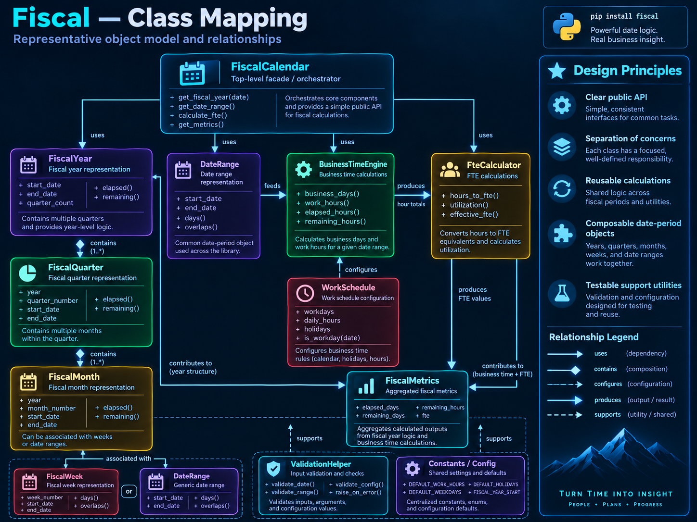

___

The API reference is generated from the package docstrings with mkdocstrings.

## Public Objects

- `DB`
- `Error`
- `FiscalYear`
- `FederalHoliday`
- `FullTimeEquivalent`
- `throw_if()`
- `to_date()`
- `to_decimal()`
- `weekday_number()`

Open the [Fiscal module reference](fiscal.md) or the dedicated
[full-time-equivalent reference](fte.md) for signatures, docstrings, inheritance, and source links.

## Fiscal-Year Hours and FTE

`FiscalYear` exposes these date-range and progress calculations:

- `compensable_hours_between(start, end, hours_per_day=8)`
- `work_hours_between(start, end, hours_per_day=8, use_observed=True)`
- `fte_between(start, end, hours_per_day=8)`
- `compensable_hours_elapsed(hours_per_day=8)`
- `compensable_hours_remaining(hours_per_day=8)`
- `work_hours_elapsed(hours_per_day=8, use_observed=True)`
- `work_hours_remaining(hours_per_day=8, use_observed=True)`

The [date-range guide](../user-guide/date-ranges.md) documents range semantics. The
[progress guide](../user-guide/progress.md) documents the `current_date` boundary used by elapsed
and remaining hours.
