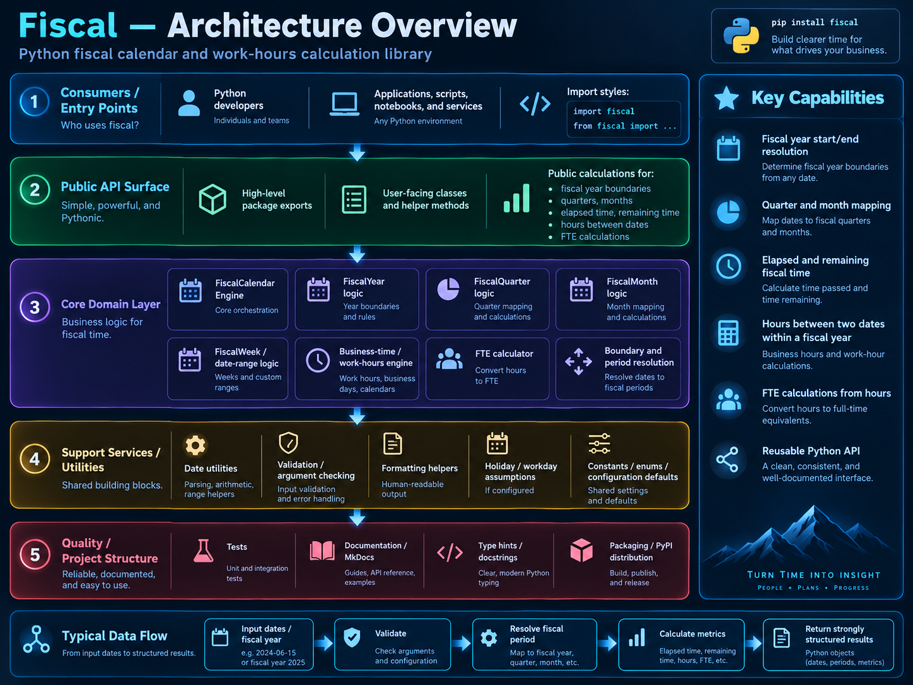
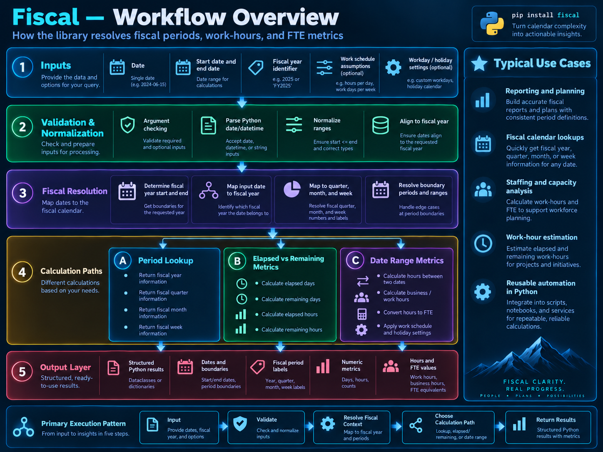

___

## Overview

Fiscal is organized around four public domain and data-access classes:

- `DB`: SQLite connection and query behavior
- `FiscalYear`: fiscal-year records and calculations
- `FederalHoliday`: federal-holiday records and observed-date behavior
- `FullTimeEquivalent`: OMB regular and pay-period civilian FTE calculations

Text and HTML calendar methods remain integrated directly into `FiscalYear`. Shared argument and
date-normalization helpers live in `fiscal.utilities`, while the FTE model is isolated in
`fiscal.fte` because it has no database dependency.

## Data Flow


___

| Component | Input | Responsibility |
| --- | --- | --- |
| `DB` | `config.DB_PATH` and `config.TABLES` | Parameterized SQLite access |
| `FiscalYear` | `BudgetFiscalYears` row | Period, range, hour, FTE, workday, and calendar calculations |
| `FederalHoliday` | `FederalHolidays` row | Actual and observed holiday behavior |
| `FullTimeEquivalent` | Fiscal year and qualifying hours | OMB-compliant civilian FTE arithmetic |

## Configuration

`config.py` supplies:

```python
DB_PATH: str
TABLES: list[ str ]
```

The expected table order is:

1. `BudgetFiscalYears`
2. `FederalHolidays`

## Fiscal-Year Entity

`FiscalYear` hydrates one database row and derives:

- calendar and fiscal progress
- fiscal month, quarter, and week boundaries
- weekday, weekend, holiday, and workday collections
- date-range day, hour, and annual FTE calculations
- elapsed and remaining compensable-hour and work-hour calculations
- holiday mappings
- text and HTML calendars for months, fiscal years, and date ranges

## Federal-Holiday Entity

`FederalHoliday` loads actual holiday dates and calculates observed dates:

- Saturday holidays are observed on Friday
- Sunday holidays are observed on Monday
- weekday holidays are unchanged

## Error Handling

Operational methods wrap exceptions with the bundled `fiscal.boogr.Error`, including module, cause,
and method metadata. This preserves the original exception as the underlying cause while presenting a
consistent package-level error contract.
